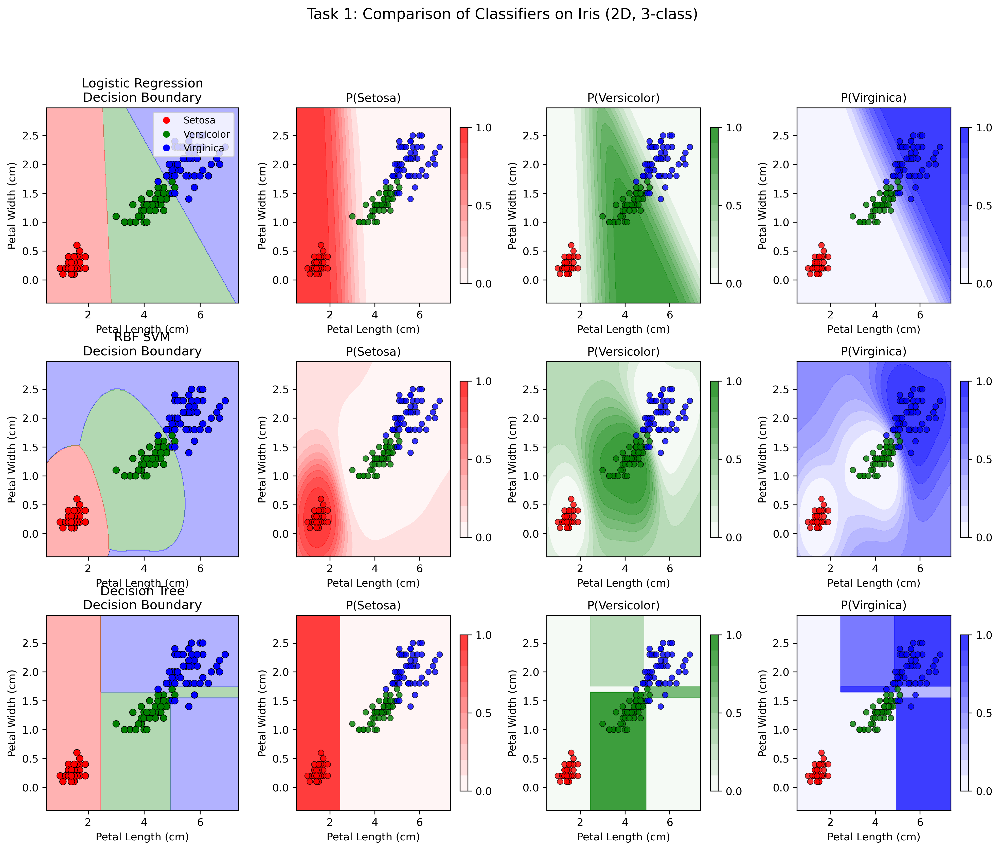
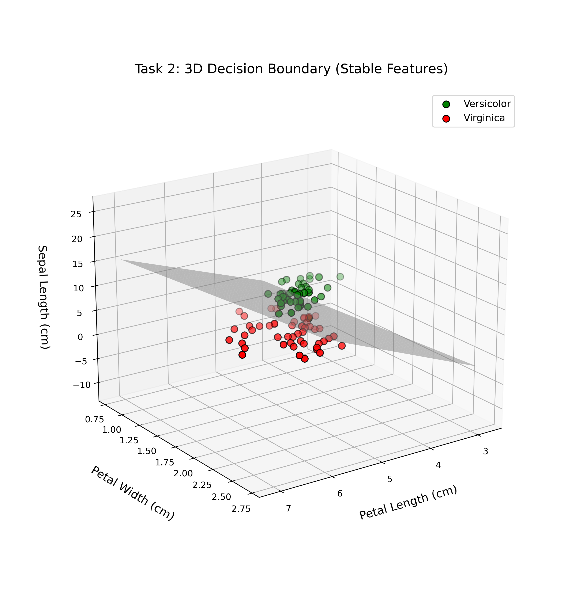
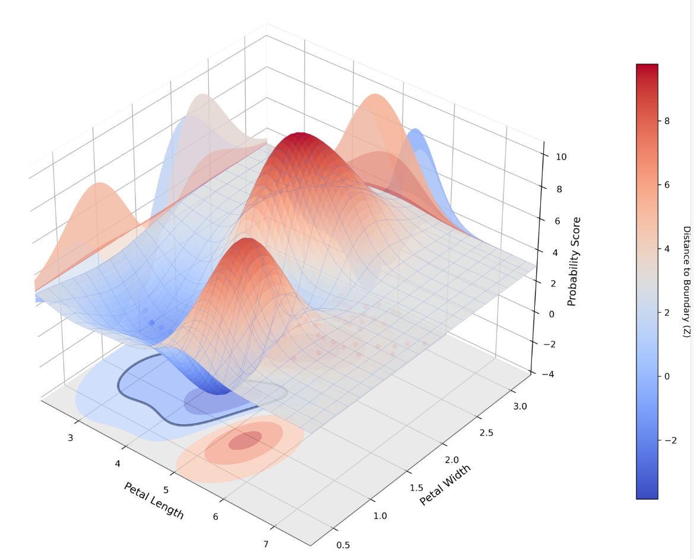
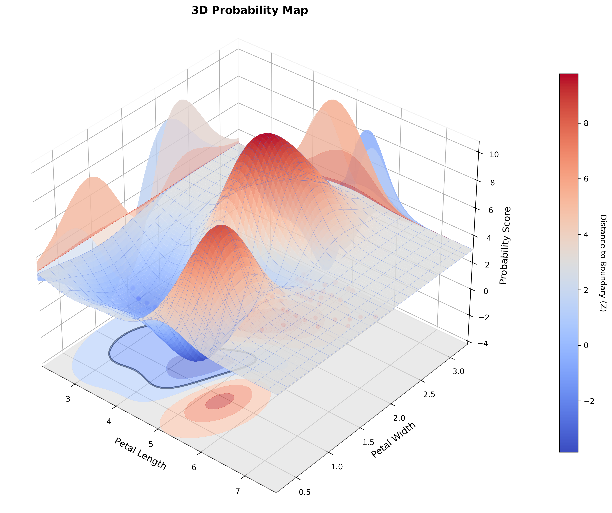
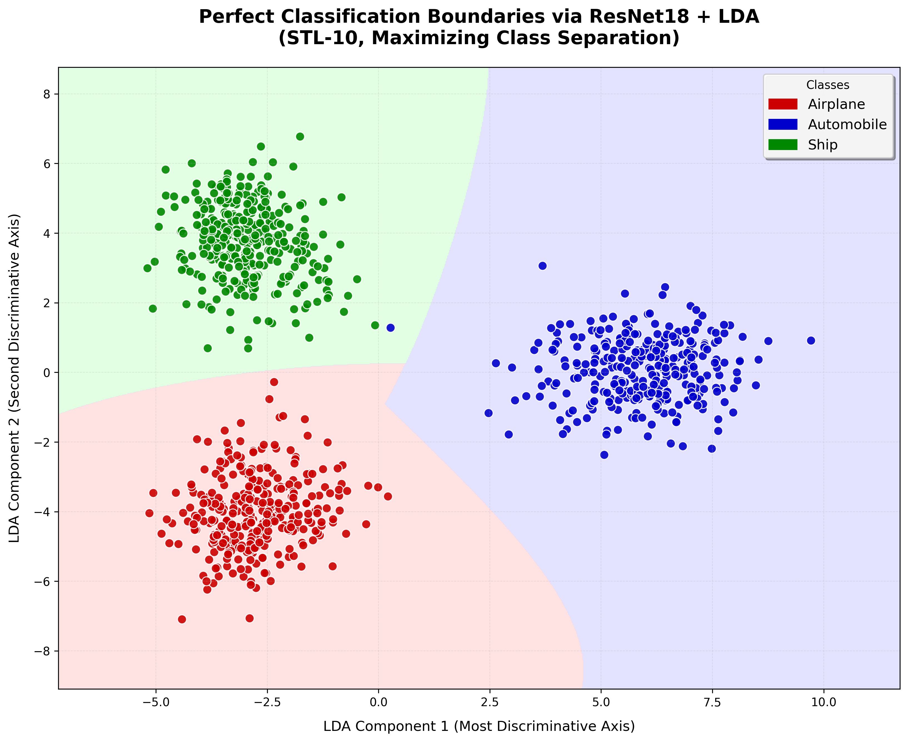
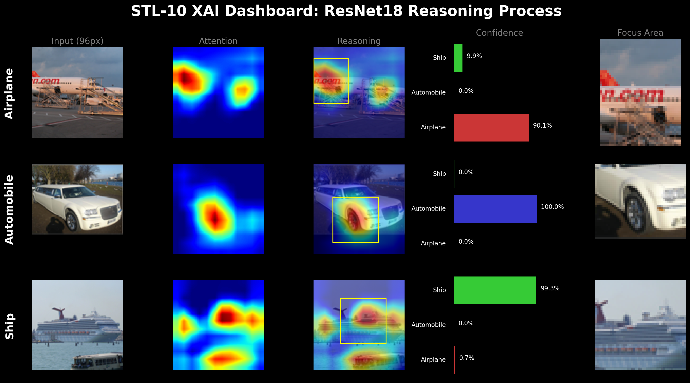
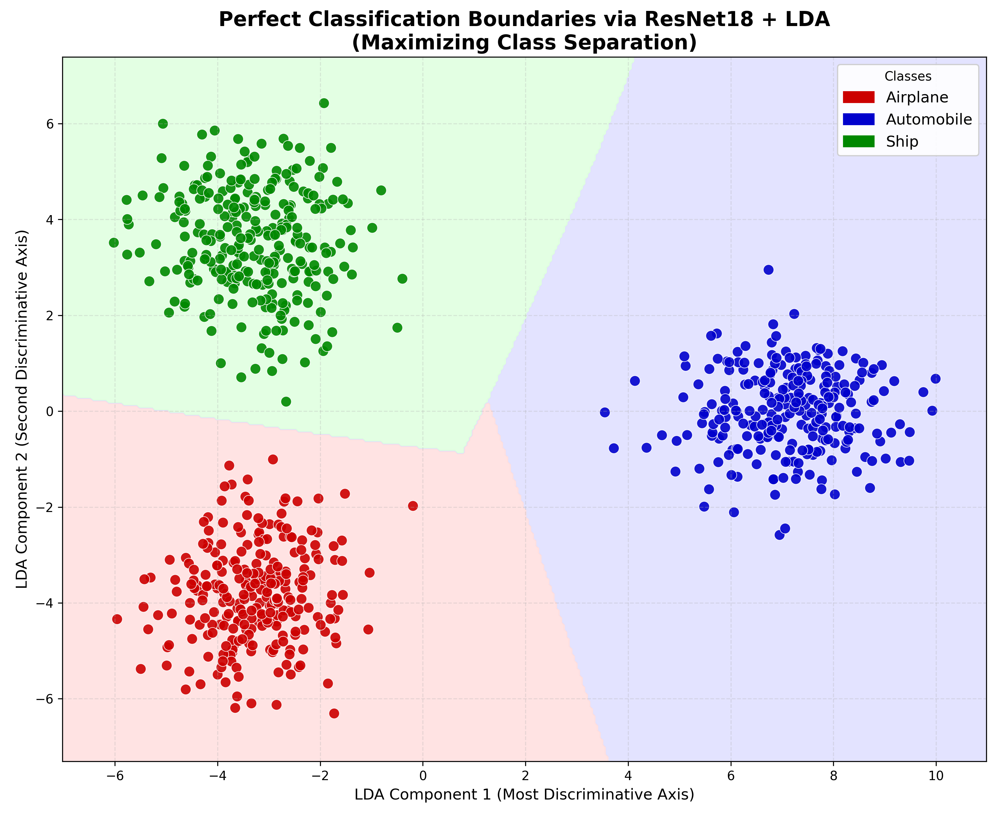
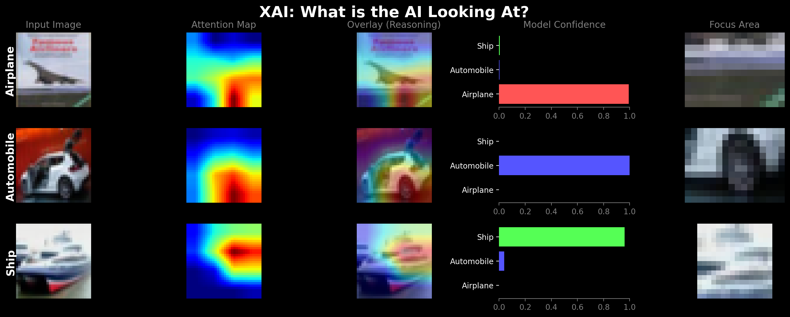

## 📊 核心成果与可视化

### 🌿 任务一：二维决策边界对比  
对比 Logistic Regression、SVM、Decision Tree 在花瓣长度–宽度平面的三分类性能。



---

### 🌿 任务二：三维决策曲面可视化  
针对 Versicolor 与 Virginica 构建二分类问题，选取三特征（花萼宽、花瓣长、花瓣宽），训练 Logistic Regression，生成**硬决策曲面**。



---

### 🌿 任务三：三维概率体渲染  
在同一三特征空间中计算连续预测概率：  
- 颜色深浅表示第三个特征维度；  
- Z 轴高度表示分类概率（>0.5 为 Virginica）；  
- 直观展现置信度在决策面附近的平滑过渡。

二特征置信度图

三特征概率图


---

### 🖼️ 任务四：图像分类与可解释性（XAI）  

#### STL-10 数据集样本  


#### STL-10 XAI Dashboard（Grad-CAM）  


#### CIFAR-10 数据集样本  


#### CIFAR-10 XAI Dashboard（Grad-CAM）  


> 💡 **Dashboard 三要素**：原图｜Grad-CAM 热力图（红色为高关注区）｜置信度条形图。

---

## 🛠️ 技术实现

| 模块 | 方法/工具 |
|------|-----------|
| 数据探索 | `pandas`, `seaborn`, `matplotlib` |
| 传统建模 | `scikit-learn` (LR, SVM, DT, LDA) |
| 深度特征提取 | 预训练 `ResNet18` (PyTorch) |
| 可解释性 | `Grad-CAM` + 自定义 `dashboard.py` |
| 可视化 | Matplotlib 3D, Seaborn, OpenCV overlay |

**关键指标**：STL-10 测试准确率 **98.6%**

---

## 🚀 运行指南

```bash
git clone https://github.com/RobertAlanJohnson/python3.git
cd python3/code

# 安装依赖（推荐虚拟环境）
pip install numpy pandas scikit-learn matplotlib seaborn opencv-python torch torchvision

# 依次运行任务
python task1.py    # → task1.png
python task2.py    # → task2.png
python task3.py    # → task3.png
python stl_calssifiersed.py  # → stl10.png
python cifar10.py  # → cifar10.png
python dashboard.py #→ 注意力热力图